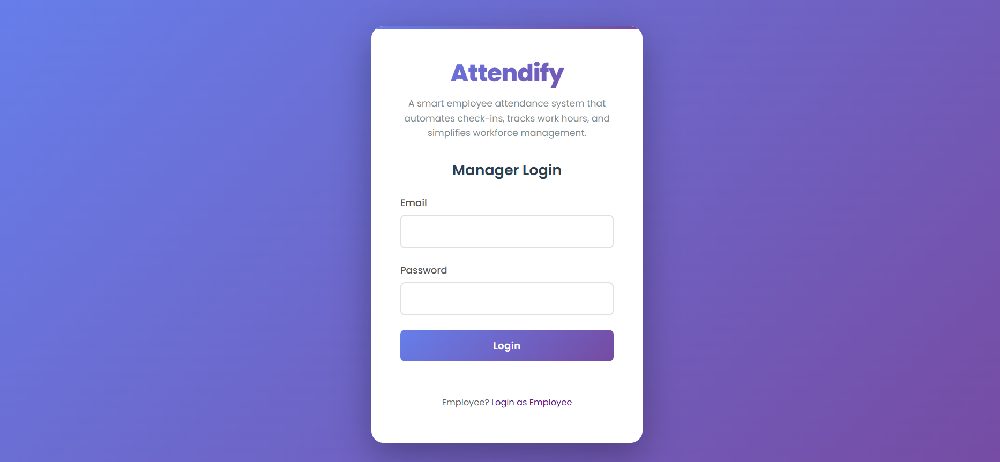

# Employee Attendance System

A comprehensive full-stack attendance tracking system with role-based access control for employees and managers.

## Tech Stack

- **Frontend**: React + Redux Toolkit
- **Backend**: Node.js + Express
- **Database**: PostgreSQL
- **Authentication**: JWT (JSON Web Tokens)

## Features

### Employee Features
- ✅ Register/Login
- ✅ Mark attendance (Check In / Check Out)
- ✅ View attendance history (Calendar and Table views)
- ✅ View monthly summary (Present/Absent/Late days)
- ✅ Dashboard with statistics
- ✅ Profile management

### Manager Features
- ✅ Login
- ✅ View all employees attendance
- ✅ Filter by employee, date, status
- ✅ View team attendance summary
- ✅ Export attendance reports (CSV)
- ✅ Dashboard with team statistics
- ✅ Team calendar view
- ✅ Department-wise analytics

## Prerequisites

Before you begin, ensure you have the following installed:
- Node.js (v14 or higher)
- PostgreSQL (v12 or higher)
- npm or yarn

## Installation

### 1. Clone the repository

```bash
git clone <repository-url>
cd attendance-system
```

### 2. Backend Setup

```bash
cd backend
npm install
```

Create a `.env` file in the `backend` directory:

```bash
cp .env.example .env
```

Edit `.env` with your database credentials:

```env
PORT=5000
DB_HOST=localhost
DB_PORT=5432
DB_NAME=attendance_system
DB_USER=postgres
DB_PASSWORD=your_password
JWT_SECRET=your-super-secret-jwt-key-change-this-in-production
```

### 3. Database Setup

**Option 1: Automatic Setup (Recommended)**

Run the setup script to create the database automatically:

```bash
cd backend
npm run setup-db
```

**Option 2: Manual Setup**

1. Connect to PostgreSQL (using psql, pgAdmin, or any PostgreSQL client):

```bash
psql -U postgres
```

2. Create the database:

```sql
CREATE DATABASE attendance_system;
```

3. Exit psql:

```sql
\q
```

**Note:** The database tables will be automatically created when you start the server. The initialization code is in `backend/config/database.js`.

### 4. Frontend Setup

```bash
cd ../frontend
npm install
```

Create a `.env` file in the `frontend` directory:

```bash
cp .env.example .env
```

The default `.env` should work if your backend runs on port 5000:

```env
REACT_APP_API_URL=http://localhost:5000/api
```

## Running the Application

### Start Backend Server

```bash
cd backend
npm start
# or for development with auto-reload
npm run dev
```

The backend server will run on `http://localhost:5000`

### Start Frontend Development Server

```bash
cd frontend
npm start
```

The frontend will run on `http://localhost:3000`

## Database Schema

### Users Table
- `id` - Primary key
- `name` - User's full name
- `email` - Unique email address
- `password` - Hashed password
- `role` - 'employee' or 'manager'
- `employeeId` - Unique employee ID (e.g., EMP001)
- `department` - Department name (optional)
- `createdAt` - Timestamp

### Attendance Table
- `id` - Primary key
- `userId` - Foreign key to users table
- `date` - Date of attendance
- `checkInTime` - Check-in timestamp
- `checkOutTime` - Check-out timestamp
- `status` - 'present', 'absent', 'late', or 'half-day'
- `totalHours` - Total hours worked
- `createdAt` - Timestamp

## API Endpoints

### Authentication
- `POST /api/auth/register` - Register new employee
- `POST /api/auth/login` - Login user
- `GET /api/auth/me` - Get current user

### Attendance (Employee)
- `POST /api/attendance/checkin` - Check in
- `POST /api/attendance/checkout` - Check out
- `GET /api/attendance/my-history` - Get attendance history
- `GET /api/attendance/my-summary` - Get monthly summary
- `GET /api/attendance/today` - Get today's status

### Attendance (Manager)
- `GET /api/attendance/all` - Get all employees attendance
- `GET /api/attendance/employee/:id` - Get specific employee attendance
- `GET /api/attendance/summary` - Get team summary
- `GET /api/attendance/export` - Export CSV
- `GET /api/attendance/today-status` - Get today's status for all employees

### Dashboard
- `GET /api/dashboard/employee` - Employee dashboard data
- `GET /api/dashboard/manager` - Manager dashboard data

## Usage

### Creating a Manager Account

**Option 1: Using the Script (Recommended)**

Run the manager creation script:

```bash
cd backend
npm run create-manager
```

The script will prompt you for:
- Manager Name
- Email
- Password (min 6 characters)
- Department (optional)

**Option 2: Manual SQL Creation**

1. Connect to PostgreSQL:
   ```bash
   psql -U postgres -d attendance_system
   ```

2. Hash the password first (using Node.js):
   ```bash
   node -e "const bcrypt = require('bcryptjs'); bcrypt.hash('your_password', 10).then(hash => console.log(hash));"
   ```

3. Insert the manager (replace the hashed password):
   ```sql
   INSERT INTO users (name, email, password, role, "employeeId", department)
   VALUES (
     'Manager Name',
     'manager@example.com',
     '$2a$10$hashed_password_from_step_2',
     'manager',
     'MGR001',
     'Management'
   );
   ```

**Note:** Manager IDs are auto-generated (MGR001, MGR002, etc.) when using the script.

### Employee Registration

Employees can register through the frontend at `/employee/register`. They will automatically be assigned an employee ID (EMP001, EMP002, etc.).

### Attendance Rules

- **Present**: Check-in before 9:30 AM and work at least 4 hours
- **Late**: Check-in after 9:30 AM
- **Half-day**: Work less than 4 hours
- **Absent**: No check-in recorded

## Project Structure

```
attendance-system/
├── backend/
│   ├── config/
│   │   └── database.js       # Database configuration and initialization
│   ├── middleware/
│   │   └── auth.js           # Authentication middleware
│   ├── routes/
│   │   ├── auth.js           # Authentication routes
│   │   ├── attendance.js    # Attendance routes
│   │   └── dashboard.js     # Dashboard routes
│   ├── server.js            # Express server setup
│   └── package.json
├── frontend/
│   ├── public/
│   ├── src/
│   │   ├── components/      # Reusable components
│   │   ├── pages/          # Page components
│   │   │   ├── employee/   # Employee pages
│   │   │   └── manager/    # Manager pages
│   │   ├── store/          # Redux store and slices
│   │   ├── App.js          # Main app component
│   │   └── index.js        # Entry point
│   └── package.json
└── README.md
```

## Development

### Backend Development

The backend uses Express with PostgreSQL. The database schema is automatically initialized when the server starts.

### Frontend Development

The frontend uses React with Redux Toolkit for state management. All API calls are handled through Redux async thunks.

## Troubleshooting

### Database Connection Issues

1. Ensure PostgreSQL is running
2. Check database credentials in `.env`
3. Verify the database exists: `psql -U postgres -l`

### Port Already in Use

If port 5000 is already in use, change the `PORT` in `backend/.env`

### CORS Issues

CORS is enabled for all origins in development. For production, update the CORS configuration in `backend/server.js`

## License

This project is open source and available under the MIT License.

## Contributing

Contributions are welcome! Please feel free to submit a Pull Request.

## 📌 Landing Page


## 📌 Manager View


## 📌 Manager Dashboard


## 📌 Attendance Mark from Employee

